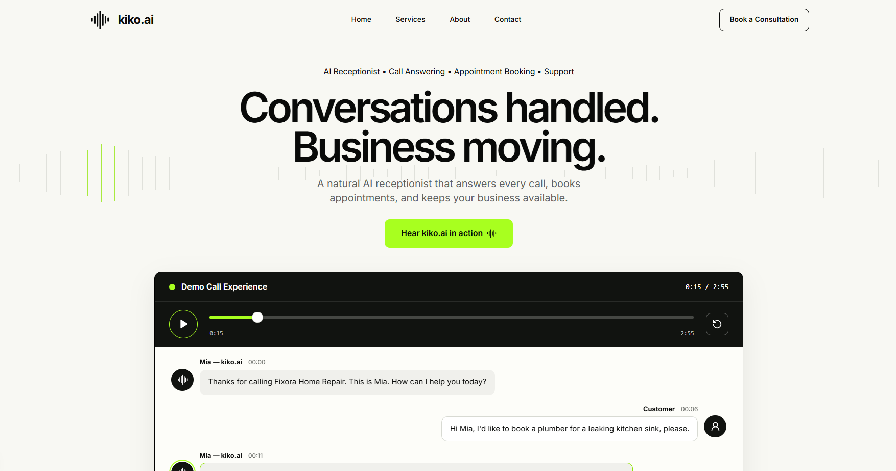

# Kiko.ai

> AI-powered voice assistant platform — converting inbound calls into booked appointments, automatically.



---

## 🚀 Tech Stack

- **Framework**: [Next.js 16](https://nextjs.org/) + React 19
- **Language**: TypeScript
- **Styling**: Tailwind CSS v3
- **Database**: [Neon](https://neon.tech/) (Serverless Postgres)
- **UI Components**: Radix UI, Lucide React

---

## 📁 Project Structure

```
kiko.ai/
├── ui/                        # Next.js app
│   ├── app/                   # App Router (pages + server actions)
│   ├── components/            # UI components (hero, calculator, form, etc.)
│   ├── lib/                   # Zod schemas, utilities
│   ├── db/                    # Database migrations
│   ├── scripts/               # DB migration runner
│   └── public/                # Static assets
├── homepage.png               # Homepage preview
├── plan.md                    # Project plan
└── README.md
```

---

## ⚙️ Getting Started

### 1. Install dependencies

```bash
cd ui
npm install
```

### 2. Set up environment variables

```bash
cp ui/.env.example ui/.env.local
```

Fill in your values in `ui/.env.local`:

```env
DATABASE_URL=postgresql://...
NEXT_PUBLIC_BOOKING_URL=
```

### 3. Run the dev server

```bash
cd ui
npm run dev
```

Open [http://localhost:3000](http://localhost:3000) to view the app.

---

## 🗄️ Database

Run migrations against your Neon database:

```bash
cd ui
npm run db:migrate
```

---

## 📄 License

Private — All rights reserved.
